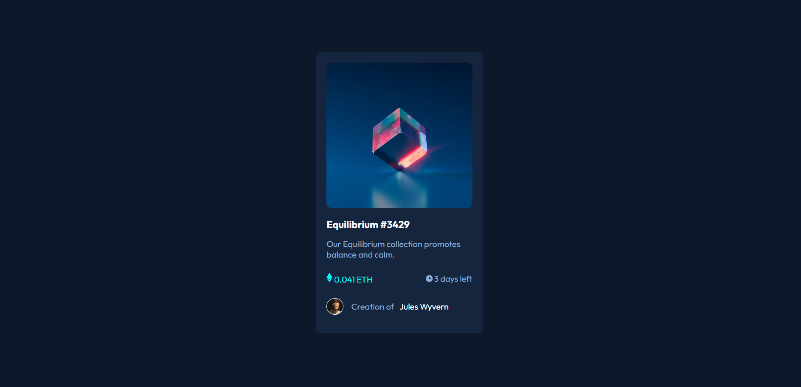
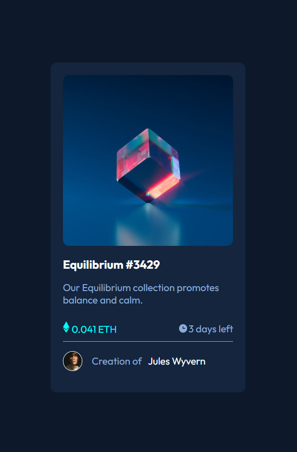
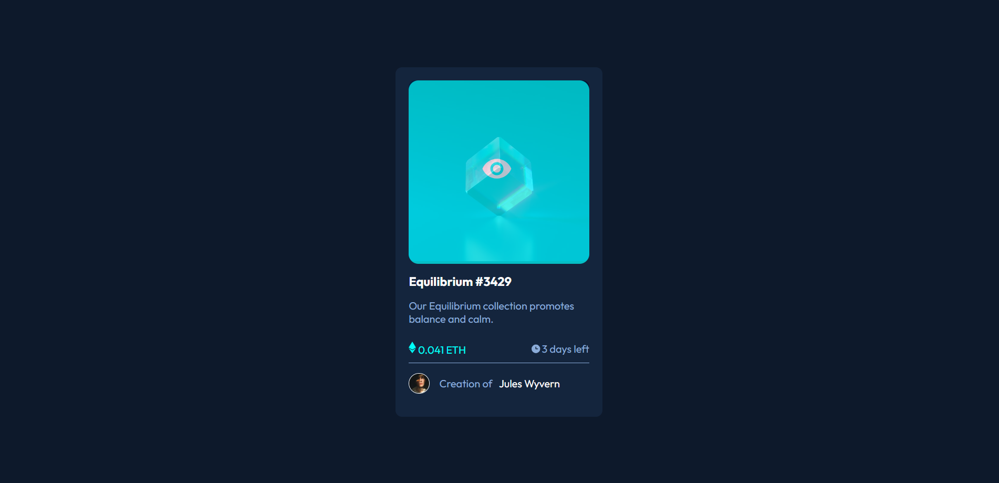

# Frontend Mentor - NFT preview card component solution

This is a solution to the [NFT preview card component challenge on Frontend Mentor](https://www.frontendmentor.io/challenges/nft-preview-card-component-SbdUL_w0U). Frontend Mentor challenges help you improve your coding skills by building realistic projects. 

## Table of contents
  - [Project published link](#Project-published-link)
  - [The challenge](#the-challenge)
  - [Screenshot](#screenshot)
  - [Built with](#built-with)
  - [Author](#author)

### Project published link: https://ajinkya9834.github.io/NFT-preview-card-practice-page/

### The challenge

Users should be able to:

- View the optimal layout depending on their device's screen size
- See hover states for interactive elements

### Screenshot

-Desktop view:

-mobile view:

-hover view:

### Built with

- Semantic HTML5 markup
- CSS properties
- Flexbox
- Mobile-first workflow

### Author

-see my other challenges on Frontend Mentor:
       Frontend Mentor - (https://www.frontendmentor.io/profile/Ajinkya9834)

-My Linkedin profile - (www.linkedin.com/in/ajinkya-hajare)

